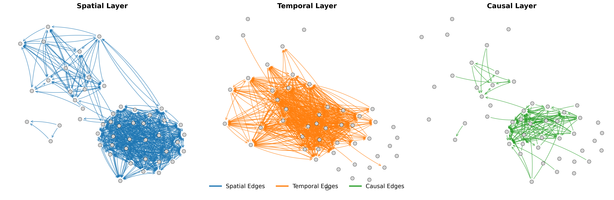

# Multilayer GNN for Grid Resilience Analysis

This repository contains the code and resources associated with the research paper **"Multilayer Graph Neural Networks for Enhancing Grid Resilience"**.  
*(Preprint available soon: [Link](#))*

## Overview

We utilize incident data from OGE to construct a **multilayer network representation** of substations in the power grid. Our approach employs **Multilayer Graph Neural Networks (GNNs)** to address key challenges in grid resilience, including:

- **Predictive Maintenance**: Identifying substations requiring urgent maintenance.
- **Multiclass Cause Prediction**: Classifying incidents based on their underlying causes using a graph-based approach.
- **Substation Clustering**: Grouping substations based on their network properties and incident patterns to identify structural similarities.
- **Incident Duration Prediction (Regression)**: Estimating the maximum duration of incidents to aid in proactive resource allocation.


### Multilayer Network Construction

The network is structured into **three interconnected layers**:

- **Spatial Layer**: Represents the physical connectivity between substations.
- **Temporal Layer**: Captures time-dependent relationships between grid events.
- **Causal Layer**: Encodes causal dependencies inferred from historical data.

Each node is enriched with relevant features derived from grid attributes, historical events, and environmental conditions.



## Repository Structure

```
multilayer-gnn-grid-resilience/
├── Data/                  # Dataset (OGE incident data, anonymized/synthetic)
├── Codes/                 # Jupyter notebooks demonstrating workflows
├── results/               # Experimental results and performance metrics
├── requirements.txt       # Python dependencies
└── LICENSE                # Repository license
```

## Workflow

### 1. Data Preprocessing
- Raw incident and grid data are **cleaned and preprocessed** using the steps outlined in the **Preprocessing Notebook**.

### 2. Multilayer Network Construction
- The **Spatial, Temporal, and Causal layers** of the graph are constructed using the **Network Construction Notebook**.
- Node features are assigned based on grid topology, incident history, and temporal patterns.

### 3. Task-Specific Analysis
- The constructed **graph network object** is **loaded across all tasks**, ensuring consistency in analysis.
- Each ML pipeline (e.g., classification, clustering, regression) is implemented in separate notebooks.

## Requirements

- Python >= 3.8
- PyTorch
- PyTorch Geometric
- NetworkX
- Scikit-learn
- NumPy, Pandas

Install dependencies using:

```bash
pip install -r requirements.txt
```

## Quick Start

Clone the repository:
```bash
git clone https://github.com/your-username/multilayer-gnn-grid-resilience.git
cd multilayer-gnn-grid-resilience
```

Run the example notebook:
```bash
jupyter notebook notebooks/Example_Workflow.ipynb
```

## Citation

If you use this work in your research, please cite:

```bibtex
@article{Mkazim, 
  title={Multilayer Graph Neural Networks for Enhancing Grid Resilience},
  author={Harun Pirim},
  journal={Elesvier},
  year={2025},
}
```

## License

This project is licensed under the MIT License. See [LICENSE](LICENSE) for details.
